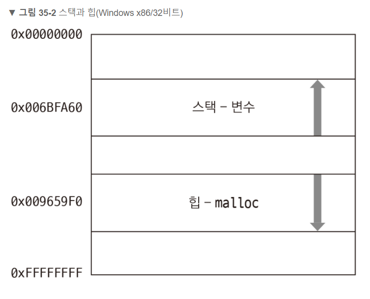
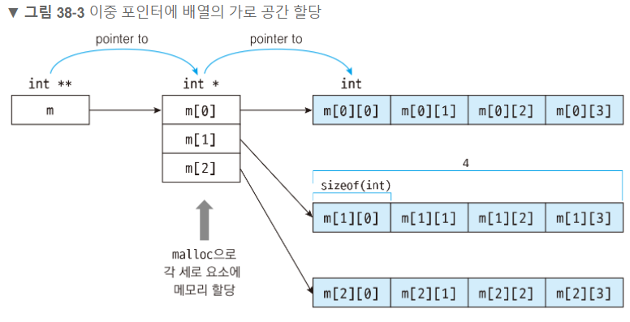

참고 : <https://dojang.io/mod/page/view.php?id=285> / 코딩도장 메모리 할당하기

## 포인터에 원하는만큼 메모리 공간을 할당받아 사용하는 방법

* 메모리 사용 패턴
malloc -> 사용 -> free

### 동적 메모리 할당(dynamic memory allocation)

원하는 시점에 원하는 만큼 메모리를 할당

## 메모리 사용
* 변수 - 스택
* malloc - 힙



* 차이점 : 스택에 생성된 변수는 사용 뒤 따로 처리를 해주지 않아도 되지만 malloc 함수를 사용하여 힙에서 할당된 메모리는 반드시 해제해야함.

## 메모리 해제

* free(포인터);
  * void free(void *_Block);

## 메모리 해제 이유

실무에서 많은 메모리를 많이 할당하며 해제를 해주지 않으면 시스템의 메모리가 부족해지므로 그것을 방지하기 위해 사용

* 메모리를 해제하지 않아 메모리 사용량이 계속 증가하는 상황을  <b>메모리 누수</b>라고 부름

```c
#include <stdio.h>
#include <stdlib.h>

int main()
{
	int num = 20;
	int *numPtr1;

	numPtr1 = &num;

	int *numPtr2;

	numPtr2 = malloc(sizeof(int));

	printf("%p\n", numPtr1);
	printf("%p\n", numPtr2);

	free(numPtr2);
}
```
>0061FF10
 <br>00BF1CD0

## 메모리에 값 저장하기

```c
#include <stdio.h>
#include <stdlib.h>    // malloc, free 함수가 선언된 헤더 파일

int main()
{
    int *numPtr;    // int형 포인터 선언

    numPtr = malloc(sizeof(int));    // int의 크기 4바이트만큼 동적 메모리 할당

    *numPtr = 10;   // 포인터를 역참조한 뒤 값 할당

    printf("%d\n", *numPtr);    // 10: 포인터를 역참조하여 메모리에 저장된 값 출력

    free(numPtr);    // 동적 메모리 해제

    return 0;
}
```
# 포인터에 할당 된 메모리를 배열처럼 사용하기
>자료형 *포인터이름 = malloc(sizeof(자료형) * 크기);

포인터에 할당된 메모리를 2차원 배열처럼 사용하기

```c
#include <stdio.h>
#include <stdlib.h>    // malloc, free 함수가 선언된 헤더 파일

int main()
{
    int **m = malloc(sizeof(int *) * 3);   // 이중 포인터에 (int 포인터 크기 * 세로 크기)만큼
                                           // 동적 메모리 할당. 배열의 세로

    for (int i = 0; i < 3; i++)            // 세로 크기만큼 반복
    {
        m[i] = malloc(sizeof(int) * 4);    // (int 크기 * 가로 크기)만큼 동적 메모리 할당.
                                           // 배열의 가로
    }

    m[0][0] = 1;    // 세로 인덱스 0, 가로 인덱스 0인 요소에 값 할당
    m[2][0] = 5;    // 세로 인덱스 2, 가로 인덱스 0인 요소에 값 할당
    m[2][3] = 2;    // 세로 인덱스 2, 가로 인덱스 3인 요소에 값 할당

    printf("%d\n", m[0][0]);    // 1: 세로 인덱스 0, 가로 인덱스 0인 요소의 값 출력
    printf("%d\n", m[2][0]);    // 5: 세로 인덱스 2, 가로 인덱스 0인 요소의 값 출력
    printf("%d\n", m[2][3]);    // 2: 세로 인덱스 2, 가로 인덱스 3인 요소의 값 출력

    for (int i = 0; i < 3; i++)    // 세로 크기만큼 반복
    {
        free(m[i]);                // 2차원 배열의 가로 공간 메모리 해제
    }

    free(m);    // 2차원 배열의 세로 공간 메모리 해제

    return 0;
}
```
>1<br>
 5<br>
 2



<font color = "red">메모리 할당 시 세로 -> 가로 순으로 할당 하였으므로 해제 할 댸는 <b>반대</b>로 가로->세로 순서로 해제